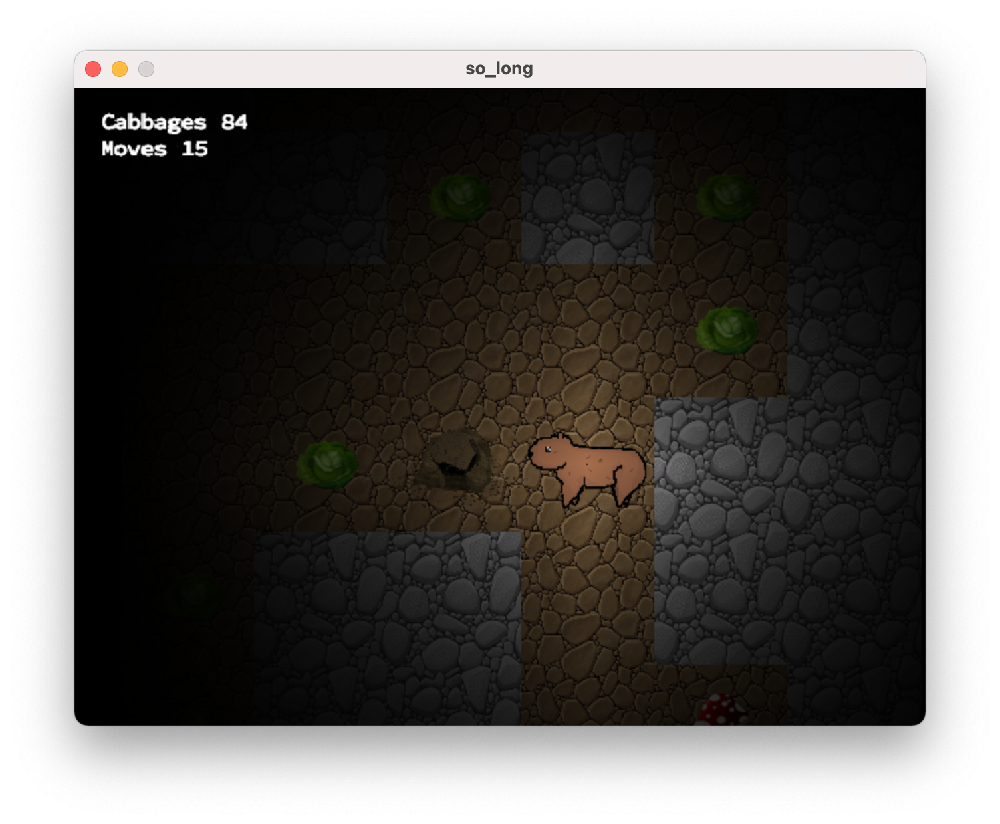

# so_long


A game where you are in control of Mr Capybara that has to eat all the Cabbages and then escape the level.

This project was built for study and it uses Minilibx library by Olivier Crouzet



## Compile

To compile the game with all features use:
```
make bonus
```

## Run

To run the game:
```
./so_long [path to map]
```
Multiple maps can be passed as an argument, for example:
```
./so_long maps/*.ber
```
Then maps can be changed using TAB or ENTER

If game was compiled using make bonus it will run automatically. maps_bonus folder contains maps with enemies and a game will fail on run using these maps if it was compiled without bonus rule.

## Map requirements

* `.ber` extension
* Be rectangular, surrounded by wall `1`
* At least 1 exit `E`
* At least 1 cabbage `C`
* Maximum 1 capybara `P`
* Optionally Mushroom `S`
* Optionally Empty `0`

## Valid map example
```
1111111
1SP0CE1
1111111
```
## Controls

| Key             | Control             |
|:---------------:|:-------------------:|
| *WASD / Arrows* | Move                |
| *R*             | Restart level       |
| *TAB / Enter*   | Change level        |
| *1-4*           | Change window size  |
| *ESC*           | Quit the game       |


